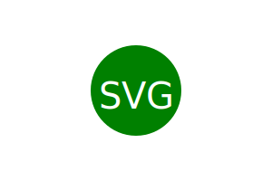

# Logo-Design


### Description

```md
AS a freelance web developer
I WANT to generate a simple logo for my projects
SO THAT I don't have to pay a graphic designer
```

## Acceptance Criteria

```md
GIVEN a command-line application that accepts user input
WHEN I am prompted for text
THEN I can enter up to three characters
WHEN I am prompted for the text color
THEN I can enter a color keyword (OR a hexadecimal number)
WHEN I am prompted for a shape
THEN I am presented with a list of shapes to choose from: circle, triangle, and square
WHEN I am prompted for the shape's color
THEN I can enter a color keyword (OR a hexadecimal number)
WHEN I have entered input for all the prompts
THEN an SVG file is created named `logo.svg`
AND the output text "Generated logo.svg" is printed in the command line
WHEN I open the `logo.svg` file in a browser
THEN I am shown a 300x200 pixel image that matches the criteria I entered
```

## Table of Contents

* [Description](#description)
* [Installation](#installation)
* [Usage](#usage)
* [Credits](#credits)
* [License](#license)
* [Contributors](#contributors)
* [Testing](#testing)
* [Questions](#questions)
* [Resources](#resources)


## Installation
The following necessary dependencies must be installed: npm inquirer, jest and lib

## Usage

Open terminal and run node index.js. You'll be prompted with questions; which will generate a professional logo. 

[Demo](<iframe src="https://bootcampspot.instructuremedia.com/embed/fe333205-2e95-4539-a19e-87c7ee09290a" frameborder="0" allowfullscreen="true" width="640" height="480"></iframe>)

## Mock-Up



## Badges
* 
* 
* 
* 
* 
* 

## Contributors

N/A


## Testing
```
run node index.js on terminal
```

## Questions

For any questions, please contact me at the following links:
* **Creator** - 🎨 Raquel Tabarez
* [](mailto:raquelstabarez.07@gmail.com)
* [](https://github.com/Raquel-t)
* [](https://raquel-t.github.io/Professional-Portfolio-2nd-assignment/)


## Resources

* [Example SVG](https://static.fullstack-bootcamp.com/fullstack-ground/module-10/circle.svg)

* [Scalable Vector Graphics (SVG)](https://en.wikipedia.org/wiki/Scalable_Vector_Graphics)

* [SVG tutorial](https://developer.mozilla.org/en-US/docs/Web/SVG/Tutorial)

* [Basic SVG shapes](https://developer.mozilla.org/en-US/docs/Web/SVG/Tutorial/Basic_Shapes)

* [Text in SVG](https://developer.mozilla.org/en-US/docs/Web/SVG/Tutorial/Texts)

* [SVG VS Code extension](https://marketplace.visualstudio.com/items?itemName=jock.svg)

## Credits